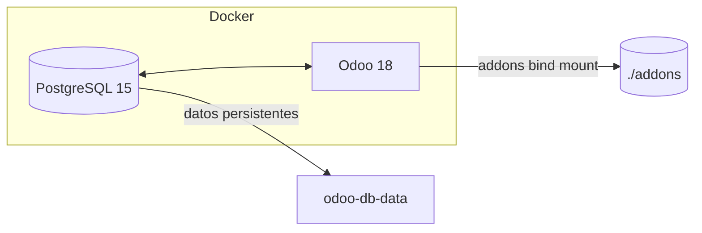

# Odoo 18 + PostgreSQL con Docker Compose

¡Bienvenido! Este repositorio contiene todo lo necesario para levantar un entorno **Odoo 18** listo para desarrollo o pruebas locales usando contenedores Docker.

---

## Índice

1. [Arquitectura](#arquitectura)
2. [Requisitos previos](#requisitos-previos)
3. [Primer uso](#primer-uso)
4. [Estructura del proyecto](#estructura-del-proyecto)
5. [Comandos de uso frecuente](#comandos-de-uso-frecuente)
6. [Flujo de trabajo para desarrollo](#flujo-de-trabajo-para-desarrollo)
7. [Backup y restore](#backup-y-restore)
8. [Actualización de Odoo o módulos](#actualización-de-odoo-o-módulos)
9. [Solución de problemas](#solución-de-problemas)

---

## Arquitectura



* **db**: contenedor con PostgreSQL 15. Almacena todas las bases de datos de Odoo.
* **odoo**: contenedor basado en `odoo:18` con los addons estándar y los módulos personalizados montados desde `./addons`.
* **odoo-db-data**: volumen Docker que persiste los datos de PostgreSQL entre reinicios.

---

## Requisitos previos

| Herramienta    | Versión recomendada |
| -------------- | ------------------- |
| Docker         | ≥ 24.x              |
| Docker Compose | ≥ v2.x              |

---

## Primer uso

```bash
# 1 - Clona el proyecto
$ git clone https://github.com/tu-usuario/tu-repo-odoo.git
$ cd tu-repo-odoo

# 2 - Copia el ejemplo de variables y modifícalo
$ cp .env.example .env
$ nano .env  # o tu editor preferido

# 3 - Arranca los contenedores (primera vez compila la imagen)
$ docker compose up -d --build

# 4 - Accede a la UI
Navega a http://localhost:8069 – usuario/contraseña: los que crees en el asistente inicial.
```

---

## Estructura del proyecto

```
.
├── addons/             # Módulos personalizados (bind-mount)
├── Dockerfile          # Extiende la imagen oficial de Odoo
├── docker-compose.yml  # Orquestación de servicios
├── .env.example        # Plantilla de variables de entorno
├── README.md           # Este documento
```

---

## Comandos de uso frecuente

| Acción                        | Comando                                                              |
| ----------------------------- | -------------------------------------------------------------------- |
| Ver logs de Odoo              | `docker compose logs -f odoo`                                        |
| Entrar al shell de Odoo       | `docker compose exec odoo bash`                                      |
| Reiniciar sólo Odoo           | `docker compose restart odoo`                                        |
| Crear un nuevo módulo         | `docker compose exec odoo odoo scaffold mi_modulo /mnt/extra-addons` |
| Instalar requerimientos extra | `docker compose exec odoo pip install -r requirements.txt`           |

---

## Flujo de trabajo para desarrollo

1. **Montaje en caliente**: Los cambios en `./addons` se reflejan inmediatamente dentro del contenedor. Basta refrescar el navegador o actualizar el módulo en Apps.
2. **Modo desarrollador**: En Odoo, ve a *Ajustes ▸ Activar «Desarrollador»* para ver menús extra.
3. **Actualización de módulos**: Desde *Apps*, activa «Actualizar apps» y busca tu módulo; marca *Actualizar*.

---


## Actualización de Odoo o módulos

* **Actualizar la base de la imagen**: Modifica la versión en `Dockerfile` (por ejemplo, `odoo:19`) y ejecuta:

  ```bash
  docker compose down
  docker compose up -d --build
  ```
* **Actualizar tus módulos**: `git pull` en el repo del módulo dentro de `addons/` y luego reinicia Odoo.

---

## Solución de problemas

| Síntoma                                     | Causa probable                                            | Solución                                                   |
| ------------------------------------------- | --------------------------------------------------------- | ---------------------------------------------------------- |
| `connection to server at "0.0.0.0" refused` | Variables `HOST`, `PORT`, `USER`, `PASSWORD` no definidas | Asegúrate de que están en el bloque `environment:` de Odoo |
| Addon no aparece en Apps                    | Falta `__manifest__.py` o no está en `ADDONS_PATH`        | Verifica ruta y reinicia Odoo                              |
| Cambios en código no aplican                | Caché de Odoo                                             | Reinicia Odoo o activa modo *desarrollador* y limpia caché |

---


¡Listo! Con esto deberías tener un entorno Odoo totalmente funcional y reproducible.
